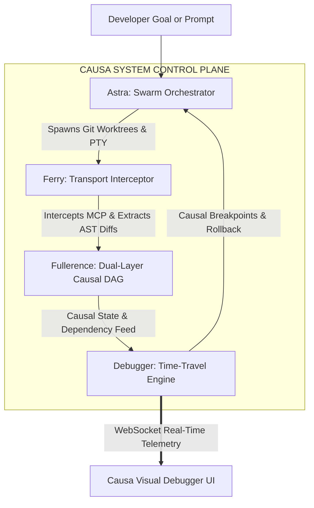
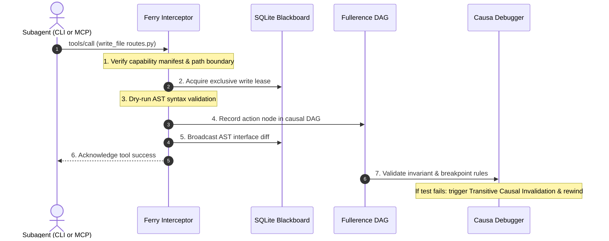

# CAUSA

> **Distributed Systems Control Plane, Transparent Transport Interceptor, and Time‑Travel Debugger for Multi‑Agent Coding Swarms.**

[](https://opensource.org/licenses/MIT)
[](https://www.python.org/downloads/)
[](https://nextjs.org/)
[](https://fastapi.tiangolo.com)
[](#)

---

## Executive Summary

Causa provides a **debuggable distributed program model** for AI coding swarms. It inserts a control plane that intercepts all agent‑system interactions, records causal actions, and supplies deterministic concurrency controls and time‑travel debugging. This eliminates silent context poisoning, un‑recoverable bad decisions, and destructive file‑level races that plague existing multi‑agent frameworks.

---

## System Architecture


---

## Core Components

### Astra – Swarm Orchestrator
*Manages process lifecycles, high‑level planning, and model routing.*
- Decomposes goals into dependency‑directed sub‑tasks.
- Routes work to appropriate model tier (Heavy, Fast Cloud, Local SLM).
- Generates typed AST skeletons to prune context tokens.
- Executes each agent in an isolated Git worktree.
- Performs pre‑commit verification and atomic merges.

### Ferry – Transport Interceptor & Pre‑Commit Engine
*Proxies MCP JSON‑RPC and PTY streams, enforcing safety.*
- Enforces capability manifests and ACLs.
- Provides deterministic read/write leases per file.
- Runs dry‑run AST parsing and syntax validation.
- Emits interface diffs to a shared SQLite blackboard.

### Fullerence – Dual‑Layer Causal & AST Knowledge Substrate
*Persistently records every action and its semantic effect.*
- Relational causal DAG links prompts, tool calls, file mutations, and test results.
- AST Interface Graph maps symbols and dependencies to causal nodes.
- Synchronises worktree Git hashes and file diffs across agents.

### Debugger – Distributed Flight Recorder & Time‑Travel Engine
*Enables causal breakpoints, rollback, and root‑cause analysis.*
- Stops execution when invariants or tests fail.
- Traverses the DAG backward to locate the first bad decision.
- Rewinds filesystem and Git state, then branches forward with alternative constraints.

### Frontend – Visual Flight Recorder UI (Next.js 14)
*Interactive web UI for real‑time observability.*
- Causal DAG visualiser (React Flow) with health‑state colouring.
- Playback bar for scrubbing execution history.
- Token‑consumption metrics per model tier.
- Direct node editing, forking, and blackboard inspection.

---

## Tech Stack

| Layer | Technology | Rationale |
|---|---|---|
| **Backend Core** | Python 3.11+ / asyncio | High‑performance async runtime with OS/PTY primitives |
| **API Server** | FastAPI + WebSockets | Sub‑millisecond real‑time event streaming |
| **Database** | SQLite (WAL) + SQLAlchemy | Zero‑configuration, high‑concurrency local storage |
| **DAG Computation** | NetworkX | Robust graph traversal for causal analysis |
| **Process Sandboxing** | pexpect / pty + Git Worktrees | Isolated filesystem per agent |
| **AST Parsing** | Tree‑sitter / Python ast | Language‑agnostic interface diff extraction |
| **Local SLM** | Ollama (qwen2.5‑coder / phi3) | Offline, zero‑cost routing and housekeeping |
| **Frontend App** | Next.js 14 + TypeScript | Component‑driven, high‑performance UI |
| **Graph Visualization** | React Flow | Interactive node‑link visualiser |
| **UI Components** | Tailwind CSS + shadcn/ui | Modern responsive developer‑tool aesthetics |

---

## Monorepo Directory Structure

```text
causa/
+-- packages/
|   +-- astra/          # Swarm orchestrator & process supervisor
|   |   +-- planner.py
|   |   +-- worktree.py
|   |   +-- pty_runner.py
|   +-- ferry/          # Transport proxy & pre‑commit engine
|   |   +-- proxy.py
|   |   +-- lock_manager.py
|   |   +-- ast_diff.py
|   |   +-- blackboard.py
|   +-- fullerence/     # Causal DAG & persistence engine
|   |   +-- graph.py
|   |   +-- storage.py
|   +-- debugger/       # Time‑travel & root‑cause analysis
|   |   +-- localization.py
|   |   +-- invalidation.py
|   |   +-- breakpoints.py
|   +-- slm/            # Local SLM client (Ollama integration)
|       +-- client.py
+-- apps/
|   +-- api/            # FastAPI control plane & WebSocket hub
|   |   +-- main.py
|   |   +-- routers/    # REST endpoints (agents, dag, leases, playback)
|   +-- ui/             # Next.js 14 visual debugger
|       +-- app/page.tsx
|       +-- components/dag/
|       +-- components/panels/
+-- scripts/            # Seed data, benchmark tests, demo scenarios
+-- tests/              # Unit and integration test suites
+-- .gitignore
+-- README.md
``` 

---

## Quick Start

### Prerequisites
- Python 3.11+
- Node.js 18+ and pnpm
- Git 2.30+
- (Optional) Ollama for local SLM routing: `ollama pull qwen2.5-coder:7b`

### 1. Clone the Repository
```bash
git clone https://github.com/codebreaker77/CAUSA.git
cd CAUSA
```

### 2. Backend Setup
```bash
python -m venv .venv
# Windows PowerShell
.\.venv\Scripts\activate
# Unix/macOS
source .venv/bin/activate
pip install -r requirements.txt
```

### 3. Frontend Setup (Dashboard)
```bash
cd apps/dashboard
npm install
```

### 4. Run Locally
```bash
# Terminal 1: Start the control‑plane API
uvicorn apps.api.main:app --host 0.0.0.0 --port 8000 --reload

# Terminal 2: Start the dashboard UI
cd apps/dashboard
npm run dev
```
Open **http://localhost:3000** in a browser to explore the DAG, blackboard, and playback controls.

---

## How Causa Compares

| Feature | Raw Agent Harnesses (Aider, Picode, SWE‑bench) | Multi‑Agent Frameworks (AutoGen, CrewAI) | **Causa** |
|---|---|---|---|
| **Execution Paradigm** | Linear append‑only transcript | Turn‑based conversational chat | **Nonlinear Causal DAG** |
| **Concurrency Safety** | None (collisions likely) | Soft prompt coordination | **Deterministic Pre‑Commit Leases** |
| **Filesystem Isolation** | Shared single folder | Shared or container‑based | **Per‑agent Git Worktrees** |
| **Interface Awareness** | Full file injection (token heavy) | Raw string passing | **AST Skeletons & Blackboard** |
| **Failure Recovery** | Retry loop (compounding errors) | Restart session | **Counterfactual Time‑Travel Rewind** |
| **Error Diagnostics** | Manual terminal log inspection | Transcript scrolling | **First‑Bad‑Decision Localization** |
| **Cross‑Agent Bleed** | Undetected cascading errors | Silent prompt pollution | **Transitive Causal Invalidation** |

---

## License

This project is licensed under the MIT License – see the [LICENSE](LICENSE) file for details.

---

## Authors & Contributors

- **Vismay Shrouty** ([@codebreaker77](https://github.com/codebreaker77)) – Architecture & System Design
- Additional contributors are listed in the repository’s `CONTRIBUTORS` file.


> **Distributed Systems Control Plane, Transparent Transport Interceptor, and Time-Travel Debugger for Multi-Agent Coding Swarms.**

[](https://opensource.org/licenses/MIT)
[](https://www.python.org/downloads/)
[](https://nextjs.org/)
[](https://fastapi.tiangolo.com)
[](#)

---

## Executive Summary and Core Thesis

Modern AI coding agents operate as **amnesiac, uncoordinated distributed processes** that frequently degrade codebases through:
1. **Silent Context Poisoning**: Agents ingest obsolete, hallucinated, or irrelevant files, polluting their reasoning context.
2. **Unrecoverable Bad Decisions**: Multi-turn errors compound uncontrollably down an append-only linear transcript, burning tokens and requiring full restarts.
3. **Multi-Agent File Collisions**: Concurrently running agents overwrite each other's code, introduce conflicting interfaces, and trigger catastrophic Git merge conflicts.

Existing multi-agent frameworks treat execution as an **append-only chat transcript**. When scaling to swarms of heterogeneous agents, this paradigm breaks down.

**Causa resolves this by conceptualizing a multi-agent coding swarm as a debuggable distributed program.**

Causa acts as a local control plane, transparent transport interceptor, and distributed systems debugger. Rather than replacing the internal reasoning loops of coding agents, Causa instruments their system interactions (process I/O, MCP calls, and filesystem mutations) to provide **causal transparency**, **deterministic concurrency protection**, and **counterfactual time-travel execution**.

---

## System Architecture



---

## Multi-Agent Interception and Concurrency Flow



---

## Core System Pillars

### 1. Astra - Heterogeneous Process and Swarm Orchestrator
Astra manages OS-level processes for any CLI-driven or MCP-compliant agent.
- **Task Ingestion and High-Level Planning**: Decomposes top-level goals into dependency-directed subtask graphs.
- **Model Routing and Scoping (Local SLM)**: Employs an on-device Small Language Model (Qwen2.5-Coder / Phi-3) to evaluate task complexity and assign tasks across model tiers:
  - **Frontier / Heavy** (Claude 3.5 Sonnet / GPT-4o) - complex refactors & core algorithms.
  - **Fast Cloud** (Gemini 1.5 Flash / Claude 3.5 Haiku) - CRUD, endpoints, schema migrations.
  - **Local SLM** (Ollama) - unit tests, documentation, typed stubs, formatting.
- **AST Context Synthesis**: Synthesizes typed skeletons and interface stubs from dependencies, pruning context tokens by up to 90%.
- **Worktree Sandboxing**: Every spawned subagent runs in a strictly isolated Git worktree (.causa/worktrees/<agent-id>), preventing filesystem collisions.
- **Intercepted PTY Process Launch**: Spawns agent CLIs via pseudo-terminals (PTY) with transparent proxy routing through Ferry.
- **Lifecycle Governance**: Maintains actor state machines (IDLE -> RUNNING -> BLOCKED -> DONE / FAILED).
- **Automated Verification and Atomic Merge**: Runs test validation inside the worktree before executing atomic 3-way merges into the parent branch.

### 2. Ferry - Transport Interceptor and Pre-Commit Engine
Ferry acts as an active, inline security and synchronization gateway between agents and the host system.
- **Transparent Interception**: Proxies MCP JSON-RPC protocol calls and terminal stdio streams in real time.
- **ACL and Capability Enforcement**: Validates every file mutation and tool call against the agent's assigned Capability Manifest.
- **Deterministic Pre-Commit Locking**: Manages read/write leases per file to eliminate race conditions and dirty writes across concurrent agents.
- **Dry-Run Lint and Syntax Validation**: Performs AST-level parsing before allowing any write operation to touch disk.
- **AST Diff Extraction**: Analyzes tree-sitter ASTs to isolate structural interface changes (classes, methods, type signatures) from internal logic changes.
- **Read-Replicated Blackboard**: Broadcasts extracted interface diffs to peer agents through a low-latency SQLite blackboard (WAL mode).

### 3. Fullerence - Dual-Layer Causal and AST Knowledge Substrate
Fullerence provides the underlying persistent relational graph connecting agent actions to codebase reality.
- **Relational Causal DAG**: Records every prompt, decision, MCP invocation, file mutation, and verification step as a typed node in a directed acyclic graph.
- **Zero-Loss State Persistence**: Stores the complete context window, token attribution, and prompt state at every discrete step T.
- **AST Interface Graph**: Maps symbols, interfaces, and file dependencies directly against the causal action nodes that introduced or modified them.
- **Multi-Worktree Daemon**: Continuously synchronizes Git commit hashes and file diffs across all active agent worktrees.

### 4. Debugger - Distributed Flight Recorder and Time-Travel Engine
The core diagnostic brain of Causa, applying classical distributed systems debugging primitives to AI swarms.
- **Causal Breakpoints**: Halts execution across single or multiple agents when semantic conditions, AST breaking changes, or test failure thresholds trigger.
- **First-Bad-Decision Localization**: Traverses the Fullerence DAG backward from a symptom (e.g. broken build) to identify the root incorrect assumption or poisoned context.
- **Token Context Attribution**: Explains why an agent made a decision by displaying the exact file lines, terminal outputs, and blackboard events active in the context window at that step.
- **Transitive Causal Invalidation**: When an agent's decision is rolled back, the debugger automatically discovers and marks all downstream dependent agents as tainted, invalidating or rolling back their states to prevent corrupted context leak.
- **Counterfactual Execution**: Rewinds the filesystem and Git worktree to an uncorrupted ancestor node and branches forward with modified constraints or alternative models.

### 5. Frontend - Visual Flight Recorder and Inspector
A reactive Next.js 14 web application providing deep observability into swarm behavior.
- **Interactive Causal DAG View**: Built with React Flow, color-coding nodes by health, failure, taint, or rollback state.
- **Active Playback Bar**: Step-indexed scrubber allowing developers to scrub backward and forward through swarm execution history.
- **Token Consumption Metrics**: Live token burn, memory footprint, and monetary cost tracking broken down per model tier.
- **Graph Forking and Node Surgery**: Direct UI controls to delete poisoned nodes, edit prompt parameters, and fork alternative execution branches.
- **Shared Blackboard Feed**: Real-time stream of broadcasted AST diffs and interface contracts.
- **SLM Inspection Panel**: Live visibility into why the local SLM selected specific models and assigned specific file bounds.

---

## Tech Stack

| Layer | Technology | Rationale |
|---|---|---|
| **Backend Core** | Python 3.11+ / asyncio | High-performance async runtime with rich OS/PTY primitives |
| **API Server** | FastAPI + WebSockets | Sub-millisecond real-time event streaming to the UI |
| **Database** | SQLite (WAL mode) + SQLAlchemy | Zero-configuration, high-concurrency local storage |
| **DAG Computation** | NetworkX | Robust graph traversal algorithms for causal analysis |
| **Process Sandboxing** | pexpect / pty + Git Worktrees | Zero filesystem collisions, universal CLI agent compatibility |
| **AST Parsing** | Tree-sitter / Python ast | Language-agnostic semantic interface diff extraction |
| **Local SLM** | Ollama (qwen2.5-coder:7b / phi3:mini) | Offline, zero-cost, sub-second routing and housekeeping |
| **Frontend App** | Next.js 14 + TypeScript | Component-driven, high-performance web dashboard |
| **Graph Visualization** | React Flow | Hardware-accelerated, interactive node-link visualization |
| **UI Components** | Tailwind CSS + shadcn/ui | Modern, responsive developer-tool aesthetics |

---

## Monorepo Directory Structure

```text
causa/
+-- packages/
|   +-- core/                  # Shared types, SQLite schemas, event definitions
|   |   +-- db/                # SQLAlchemy database models (nodes, leases, blackboard)
|   |   +-- schemas/           # Pydantic schemas for DAG nodes & manifests
|   +-- astra/                 # Swarm orchestrator & process supervisor
|   |   +-- planner.py         # Subtask decomposition & model router (Local SLM)
|   |   +-- worktree.py        # Git worktree sandbox lifecycle manager
|   |   +-- pty_runner.py      # PTY pseudo-terminal process spawner
|   +-- ferry/                 # Transport proxy & pre-commit engine
|   |   +-- proxy.py           # MCP JSON-RPC & stdio interceptor
|   |   +-- lock_manager.py    # Read/write lease coordinator
|   |   +-- ast_diff.py        # Tree-sitter interface diff extractor
|   |   +-- blackboard.py      # SQLite-backed shared interface board
|   +-- fullerence/            # Causal DAG & persistence engine
|   |   +-- graph.py           # NetworkX dual-layer causal DAG wrapper
|   |   +-- storage.py         # Zero-loss context snapshot persistence
|   +-- debugger/              # Time-travel & root-cause analyzer
|   |   +-- localization.py    # First-bad-decision backward traversal
|   |   +-- invalidation.py    # Transitive causal rollback engine
|   |   +-- breakpoints.py     # Semantic breakpoint evaluator
|   +-- slm/                   # Local SLM client (Ollama integration)
|       +-- client.py          # Model routing, context pruning, & failure tagging
+-- apps/
|   +-- api/                   # FastAPI control plane & WebSocket hub
|   |   +-- main.py            # API entrypoint
|   |   +-- routers/           # REST endpoints (agents, dag, leases, playback)
|   +-- ui/                    # Next.js 14 visual flight recorder
|       +-- app/page.tsx       # Main debugger dashboard
|       +-- components/dag/    # React Flow causal graph visualizer
|       +-- components/panels/ # Blackboard, metrics, playback bar, inspector
+-- scripts/                   # Seed data, benchmark tests, demo scenarios
+-- tests/                     # Unit and integration test suites
+-- .gitignore
+-- README.md
```

---

## Quick Start

### Prerequisites
- Python 3.11+
- Node.js 18+ and pnpm
- Git 2.30+
- Ollama (optional, for local SLM routing): `ollama pull qwen2.5-coder:7b`

### 1. Clone the Repository
```bash
git clone https://github.com/codebreaker77/CAUSA.git
cd CAUSA
```

### 2. Backend Setup
```bash
python -m venv .venv
source .venv/bin/activate  # On Windows: .venv\Scripts\activate
pip install fastapi uvicorn sqlalchemy networkx pexpect gitpython aiohttp websockets
```

### 3. Frontend Setup (Dashboard)
```bash
cd apps/dashboard
npm install
```

### 4. Run Causa Locally
```bash
# Terminal 1: Start Causa Control Plane API
uvicorn apps.api.main:app --host 0.0.0.0 --port 8000 --reload

# Terminal 2: Start the dashboard UI
cd apps/dashboard
npm run dev
```
Open **http://localhost:3000** in your browser.

---

## How Causa Compares

| Feature | Raw Agent Harnesses (Aider, Picode, SWE-bench) | Multi-Agent Frameworks (AutoGen, CrewAI) | Causa |
|:---|:---|:---|:---|
| **Execution Paradigm** | Linear append-only transcript | Turn-based conversational chat | **Nonlinear Causal DAG** |
| **Concurrency Safety** | None (collisions likely) | Soft prompt coordination | **Deterministic Pre-Commit Leases** |
| **Filesystem Isolation** | Shared single folder | Shared or container-based | **Per-agent Git Worktrees** |
| **Interface Awareness** | Full file injection (token heavy) | Raw string passing | **AST Skeletons & Blackboard** |
| **Failure Recovery** | Retry loop (compounding errors) | Restart session | **Counterfactual Time-Travel Rewind** |
| **Error Diagnostics** | Manual terminal log inspection | Transcript scrolling | **First-Bad-Decision Localization** |
| **Cross-Agent Bleed** | Undetected cascading errors | Silent prompt pollution | **Transitive Causal Invalidation** |

---

## License

This project is licensed under the MIT License - see the [LICENSE](LICENSE) file for details.

## Authors & Contributors

- **Vismay Shrouty** ([@codebreaker77](https://github.com/codebreaker77)) - *Architecture & System Design*
