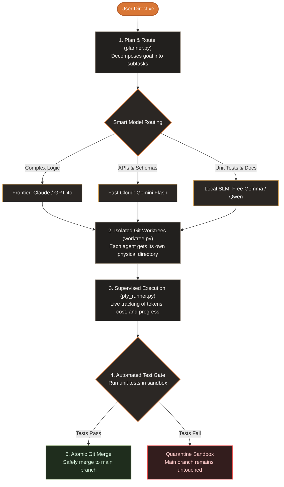

```mermaid
flowchart TD
    classDef startNode fill:#d97736,stroke:#b35c2b,stroke-width:2px,color:#fff;
    classDef stepNode fill:#22201e,stroke:#8c8275,stroke-width:1.5px,color:#f5f0eb;
    classDef modelNode fill:#2b2724,stroke:#d4a359,stroke-width:1.5px,color:#fff;
    classDef decisionNode fill:#2b2724,stroke:#d97736,stroke-width:2px,color:#fff;
    classDef successNode fill:#1f2d1d,stroke:#7a9a60,stroke-width:2px,color:#d8f3dc;
    classDef failNode fill:#331d1d,stroke:#eb4d4b,stroke-width:2px,color:#ffc9c9;

    Start(["User Directive"]):::startNode --> Planner["1. Plan & Route (planner.py)<br/>Decomposes goal into subtasks"]:::stepNode

    Planner --> Router{"Smart Model Routing"}:::decisionNode
    Router -->|"Complex Logic"| Frontier["Frontier: Claude / GPT-4o"]:::modelNode
    Router -->|"APIs & Schemas"| FastCloud["Fast Cloud: Gemini Flash"]:::modelNode
    Router -->|"Unit Tests & Docs"| LocalSLM["Local SLM: Free Gemma / Qwen"]:::modelNode

    Frontier & FastCloud & LocalSLM --> Sandbox["2. Isolated Git Worktrees (worktree.py)<br/>Each agent gets its own physical directory"]:::stepNode

    Sandbox --> Supervise["3. Supervised Execution (pty_runner.py)<br/>Live tracking of tokens, cost, and progress"]:::stepNode

    Supervise --> TestGate{"4. Automated Test Gate<br/>Run unit tests in sandbox"}:::decisionNode

    TestGate -->|"Tests Pass"| Merge["5. Atomic Git Merge<br/>Safely merge to main branch"]:::successNode
    TestGate -->|"Tests Fail"| Quarantine["Quarantine Sandbox<br/>Main branch remains untouched"]:::failNode
```
