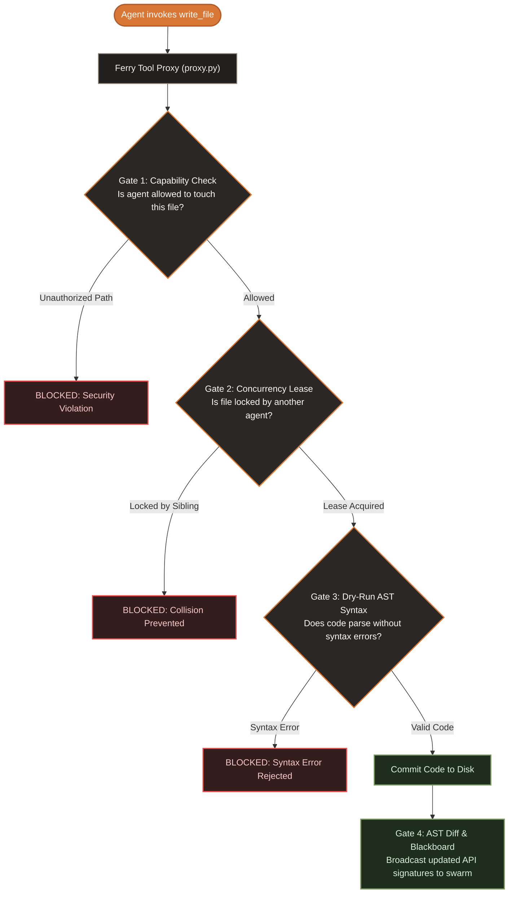

```mermaid
flowchart TD
    classDef agentNode fill:#d97736,stroke:#b35c2b,stroke-width:2px,color:#fff;
    classDef gateNode fill:#22201e,stroke:#8c8275,stroke-width:1.5px,color:#f5f0eb;
    classDef decisionNode fill:#2b2724,stroke:#d97736,stroke-width:2px,color:#fff;
    classDef successNode fill:#1f2d1d,stroke:#7a9a60,stroke-width:2px,color:#d8f3dc;
    classDef failNode fill:#331d1d,stroke:#eb4d4b,stroke-width:2px,color:#ffc9c9;

    Agent(["Agent invokes write_file"]):::agentNode --> Ferry["Ferry Tool Proxy (proxy.py)"]:::gateNode

    Ferry --> Gate1{"Gate 1: Capability Check<br/>Is agent allowed to touch this file?"}:::decisionNode
    Gate1 -->|"Unauthorized Path"| Block1["BLOCKED: Security Violation"]:::failNode

    Gate1 -->|"Allowed"| Gate2{"Gate 2: Concurrency Lease<br/>Is file locked by another agent?"}:::decisionNode
    Gate2 -->|"Locked by Sibling"| Block2["BLOCKED: Collision Prevented"]:::failNode

    Gate2 -->|"Lease Acquired"| Gate3{"Gate 3: Dry-Run AST Syntax<br/>Does code parse without syntax errors?"}:::decisionNode
    Gate3 -->|"Syntax Error"| Block3["BLOCKED: Syntax Error Rejected"]:::failNode

    Gate3 -->|"Valid Code"| DiskCommit["Commit Code to Disk"]:::successNode

    DiskCommit --> Gate4["Gate 4: AST Diff & Blackboard<br/>Broadcast updated API signatures to swarm"]:::successNode
```
