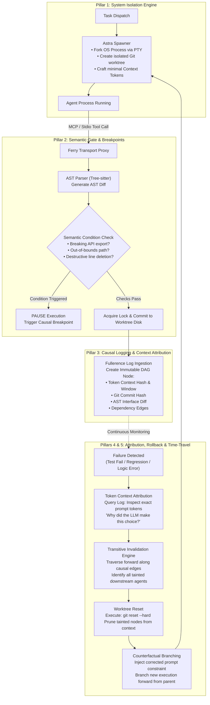

```mermaid
flowchart TD
    subgraph P1["Pillar 1: System Isolation Engine"]
        Init["Task Dispatch"] --> Astra["Astra Spawner\n• Fork OS Process via PTY\n• Create isolated Git worktree\n• Craft minimal Context Tokens"]
        Astra --> Agent["Agent Process Running"]
    end

    subgraph P2["Pillar 2: Semantic Gate & Breakpoints"]
        Agent -->|MCP / Stdio Tool Call| Ferry["Ferry Transport Proxy"]
        Ferry --> TreeSitter["AST Parser (Tree-sitter)\nGenerate AST Diff"]
        TreeSitter --> Breakpoint{"Semantic Condition Check\n• Breaking API export?\n• Out-of-bounds path?\n• Destructive line deletion?"}
        Breakpoint -->|Condition Triggered| Halt["PAUSE Execution\nTrigger Causal Breakpoint"]
        Breakpoint -->|Checks Pass| CommitFS["Acquire Lock & Commit to Worktree Disk"]
    end

    subgraph P3["Pillar 3: Causal Logging & Context Attribution"]
        CommitFS --> LogNode["Fullerence Log Ingestion\nCreate Immutable DAG Node:\n• Token Context Hash & Window\n• Git Commit Hash\n• AST Interface Diff\n• Dependency Edges"]
    end

    subgraph P4["Pillars 4 & 5: Attribution, Rollback & Time-Travel"]
        TestFail["Failure Detected\n(Test Fail / Regression / Logic Error)"] --> Attrib["Token Context Attribution\nQuery Log: Inspect exact prompt tokens\n'Why did the LLM make this choice?'"]
        Attrib --> Invalidation["Transitive Invalidation Engine\nTraverse forward along causal edges\nIdentify all tainted downstream agents"]
        Invalidation --> Rollback["Worktree Reset\nExecute: git reset --hard <clean_parent_commit>\nPrune tainted nodes from context"]
        Rollback --> Branch["Counterfactual Branching\nInject corrected prompt constraint\nBranch new execution forward from parent"]
    end

    LogNode -.->|Continuous Monitoring| TestFail
    Branch --> Astra
```
